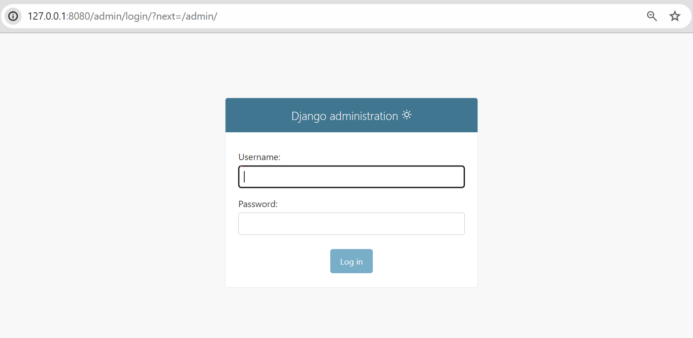
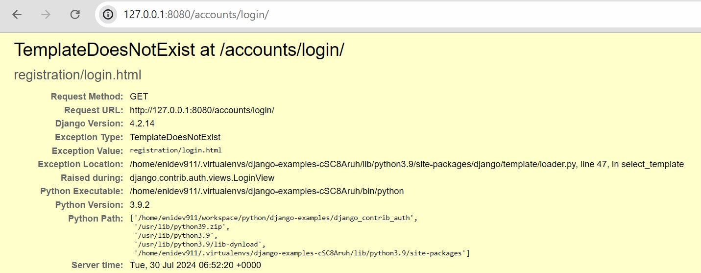
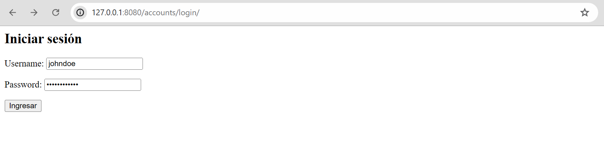



# Django login y logout

En este artículo, aprenderemos a configurar el [sistema completo de autenticación de usuarios](https://docs.djangoproject.com/en/5.0/topics/auth/) en Django que consta de inicio de sesión, cierre de sesión, registro, cambio de contraseña y restablecimiento de contraseña.

<!-- more -->

## Crear un proyecto de Django

Con su entorno virtual configurado y activado y Django instalado, ahora puede crear un proyecto:

!!! info "Recuerda"
	Para configurar un entorno virtual y comenzar a trabajar con el framework Django, tienes el capítulo "Comenzar" en este sitio web.

```bash
django-admin startproject django_contrib_auth
```

Al ejecutarse el comando se crea una estructura de carpetas predeterminada, que incluye algunos archivos de Python y su aplicación de administración que tiene el mismo nombre que su proyecto:

```bash
 django_contrib_auth #(1)!
├──  django_contrib_auth #(2)!
│   ├──  __init__.py
│   ├──  asgy.py
│   ├──  settings.py
│   ├──  urls.py
│   └──  wsgy.py
└──  manage.py #(3)!
```

1. Es la carpeta de proyecto de nivel superior.
2. Es la carpeta de nivel inferior que representa su aplicación de administración.
3. Es un script Python que funciona como centro de comando de su proyecto.

Cuando generamos un proyecto predeterminado utilizando el comando `startproject` en Django tenemos habilitado solamente el sitio administrador que lo podemos ver visitando la URL `/admin/` una vez corremos el comando [`runserver`]().

{style="border: 1px solid #ccc"}

De forma predeterminada, para iniciar sesión en el administrador es necesario que un usuario tenga el atributo `is_staff` en `True` pero no podrá realizar acciones si no tiene los permisos correspondientes para dichas acciones sobre las aplicaciones que se agreguen.

Para poder iniciar sesión, podemos utilizar el comando [`createuser`](https://docs.djangoproject.com/en/5.0/ref/django-admin/#django-admin-createsuperuser) pero antes debemos correr la migración inicial con el comando [`python manage.py migrate`](https://docs.djangoproject.com/en/5.0/ref/django-admin/#migrate){:target='blank'}. El siguiente ejemplo muestra como crear el superusuario:

=== "bash :octicons-terminal-16:"
	```bash
	python manage.py createsuperuser
	```
=== "output :octicons-terminal-16:"

	```bash
	Username: johndoe
	Email address: johndoe@dummymail.com
	Password:
	Password (again):
	This password is too short. It must contain at least 8 characters.
	This password is too common.
	This password is entirely numeric.
	Bypass password validation and create user anyway? [y/N]: y
	Superuser created successfully.
	```


El módulo `contrib` de Django ofrece aplicaciones integradas para ayudar con el desarrollo. En el archivo `settings.py` buscaremos la lista de `INSTALLED_APPS` y vas a encontrar que `auth` ya se encuentra disponible para nosotros:

=== "settings.py"

	```py hl_lines="3"
	INSTALLED_APPS = [
    	'django.contrib.admin',
    	'django.contrib.auth',
    	'django.contrib.contenttypes',
    	'django.contrib.sessions',
    	'django.contrib.messages',
    	'django.contrib.staticfiles',
	]
	```

=== "explorador"

	```plaintext hl_lines="5"
	 django_contrib_auth
	└──  django_contrib_auth
    	├──  __init__.py
    	├──  asgi.py
    	├──  settings.py
    	├──  urls.py
    	└──  wsgi.py
	```

Para usar la aplicación `auth`, debemos agregarla a nuestro `urls.py` a nivel del proyecto. En la parte superior, importamos `include` y agregamos una nueva URL en `accounts/` ya que este nombre es una práctica estándar y requiere menos personalización más adelante:


=== "urls.py"

	```python hl_lines="2 6"
	from django.contrib import admin
	from django.urls import path, include
	
	urlpatterns = [
		path("admin/", admin.site.urls),
		path("accounts/", include("django.contrib.auth.urls"))
	]
	```

=== "explorador"

	```plaintext hl_lines="6"
	 django_contrib_auth
	└──  django_contrib_auth
    	├──  __init__.py
    	├──  asgi.py
    	├──  settings.py
    	├──  urls.py
    	└──  wsgi.py
	```

La aplicación `auth` nos proporciona multiples [vistas de autenticación](https://docs.djangoproject.com/en/5.0/topics/auth/default/#module-django.contrib.auth.views) y URL para gestionar el inicio de sesión, cierre de sesión, cambio de contraseña, restablecimiento de contraseña, etc. **Notablemente**, no incluye una vista y URL para el registro, por lo que debemos configurarlo nosotros mismos:

|Ruta|Método|Name|Descripción|
|:---|:-----|:---|:----------|
|`accounts/login/`|`GET`|`[name='login']`|Inicio de sesión Login|
|`accounts/logout/`|`GET`|`[name='logout']`|Cierre de sesión Logout|
|`accounts/password_change/`|`GET`|`[name='password_change']`|Cambio de contraseña|
|`accounts/password_change/done/`|`GET`|`[name='password_change_done']`|Página de cambio de contraseña exitoso|
|`accounts/password_reset/`|`GET`|`[name='password_reset']`|Página para resetear la contraseña|

Una vez hecho lo anterior, ponemos en marcha el servidor y visitamos la URL <http://127.0.0.1:8080/accounts/login/> ocurrirá que se nos mostrará el siguiente error:

{style="border: 1px solid #ccc"}

Lo anterior se debe a que Django no encuentra ninguna plantilla para mostrar, pero nos indica la ubicación predeterminada de la plantilla de inicio de sesión que es `registration/login.html`.

## Página de inicio de sesión

De manera predeterminada. Django buscará dentro de un carpeta `templates` una subcarpeta llamada `registration`. La plantilla de inicio de sesión se llama `login.html`.

Como no hemos configurado ninguna aplicación, vamos añadir a la configuración una línea para que se pueda buscar en la raíz del proyecto las plantillas y asi evitar generar una nueva aplicación. Buscamos en el archivo `settings.py` la variables `TEMPLATES` y modificamos lo siguiente:

```python title="settings.py" hl_lines="4"
TEMPLATES = [
    {
        'BACKEND': 'django.template.backends.django.DjangoTemplates',
        'DIRS': ['templates'],
        'APP_DIRS': True,
        'OPTIONS': {
            'context_processors': [
                'django.template.context_processors.debug',
                'django.template.context_processors.request',
                'django.contrib.auth.context_processors.auth',
                'django.contrib.messages.context_processors.messages',
            ],
        },
    },
]
```

Luego se crean esas carpetas y el archivo, nos debe quedar la estructura de carpeta de la siguiente forma:

```plaintext hl_lines="9-11"
 django_contrib_auth
├──  django_contrib_auth
│   ├──  __init__.py
│   ├──  asgi.py
│   ├──  settings.py
│   ├──  urls.py
│   ├──  views.py
│   └──  wsgi.py
├──  templates
│   └──  registration
│       └──  login.html
├──  db.sqlite3
└──  manage.py
```

Ahora si añadimos lo siguiente, podemos renderizar la página de inicio de sesión:

```html title="login.html"
<h2>Iniciar sesión</h2>
<form method="post">
   <!--(1)!-->
  {{ form.as_p }} <!--(2)!-->
  <button type="submit">Ingresar</button>
</form>
```

1. Se añade por cuestiones de seguridad
2. EL contenido del formulario se almacena en `{{ form }}`

{style="border: 1px solid #ccc;"}


Nuestra función de inicio de sesión ahora funciona, pero debemos especificar a dónde redirigir al usuario luego de iniciar sesión correctamente mediante `LOGIN_REDIRECT_URL` en la configuración. En la parte superior del archivo `settings.py` agregamos lo siguiente:

```py hl_lines="4" title="settings.py"
from pathlib import Path

BASE_DIR = Path(__file__).resolve().parent.parent
LOGIN_REDIRECT_URL = "/"
```

Solo podemos iniciar sesión si tenemos una cuenta de usuario. Y como todavía falta añadir un formulario de registro, el único usuario es el superusuario que creamos desde la línea de comandos.

Aprovechando la [herencia de plantillas](https://docs.djangoproject.com/es/5.0/ref/templates/language/#template-inheritance){target='blank'} del motor de plantillas de Django podemos agregar una sencilla navegación en un archivo `base.html` en la carpeta `templates`:

```html title="templates/base.html"
<!DOCTYPE html>
<html lang="es">
<head>
    <title>Bienvenido</title>
</head>
<body>
	<main>
		<ul class="menu">
			<li><a href="">Iniciar sesión</a></li>
			<li><a href="">Registrarse</a></li>
		</ul>
		<div id="content">
			
		</div>
	</main>
</body>
</html>
```

Luego abrimos nuevamente :octicons-file-code-16: `templates/registration/login.html` y añadimos lo siguiente:

```html title="templates/registration/login.html"


<h2>Iniciar sesión</h2>
<form method="post">
   
  {{ form.as_p }} 
  <button type="submit">Ingresar</button>
</form>

```


## Botón de cerrar sesión

Uno de los cambios de Django 5.0, como se indica en las [notas de la versión](https://docs.djangoproject.com/en/5.0/releases/5.0/), es la eliminación de la compatibilidad con el cierre de sesión mediante solicitudes `GET`. En versiones anteriores de Django, se podía agregar un enlace de cierre de sesión como el siguiente ejemplo:

```html title="HTML"
<a href="">Log Out</a>
```

## Página de registro

Ahora que hemos resuelto el tema de inicio y cierre de sesión, podemos agregar la página de registro al sitio básico de Django. Si recordamos Django no proporciona una vista o URL integrada para esto.

La forma más sencilla de implementar el registro de un usuario es utilizar `UserCreationForm` tal como está. Esta estrategia es adecuada en caso de que esté utilizando el usuario predeterminado de Django, utilice **el nombre de usuario** para autenticarse y solo esté interesado en configurar el **nombre de usuario** y **contraseña** al registrarse. En el siguiente bloque podemos alternar entre las tabs y ver el contenido de los archivos involucrados:

=== ":octicons-file-code-16: urls.py"

	```python hl_lines="7" title="django_contrib_auth/urls.py"
	from django.contrib import admin
	from django.urls import path, include
	
	urlpatterns = [
		path("admin/", admin.site.urls),
		path("accounts/", include("django.contrib.auth.urls")),
		path("accounts/signup", signup, name='signup'),
	]
	```
=== ":octicons-file-code-16: views.py"

	```py hl_lines="3" title="django_contrib_auth/views.py"
	from django.contrib.auth import login, authenticate
	from django.shortcuts import render, redirect
	from django.contrib.auth.forms import UserCreationForm
	
	def signup(request):
		if request.method == 'POST':
			form = UserCreationForm(request.POST)
			if form.is_valid():
				form.save() #(1)!
				username = form.cleaned_data.get('username')
				raw_password = form.cleaned_data.get('password1')
				user = authenticate(username=username, password=raw_password)
				login(request, user)
				return redirect('index') #(2)!
		else:
			form = UserCreationForm()
		return render(request, 'signup.html', {'form': form})
	```

	1. Se guarda al usuario en la base de datos.
	2. Redirigimos al usuario una vez autenticado a la página de inicio.

=== ":octicons-file-code-16: signup.html"
	```html title="templates/registration/signup.html"
	
	
	
	<h2>Registrarse</h2>
	<form action="post">
		
		{{ form.as_p }}
		<button type="submit">Crear</button>
	</form>
	
	```

Básicamente, lo que estamos haciendo es manejar el procesamieto de `UserCreationForm`. Una vez que el código llega a `form.save()`, se crea el usuario. Pero aquí debemos dar un paso más, y es autenticar al usuario para luego redirigir al usuario a la página de inicio de sesión, pero realizar la autenticación es bueno para la experiencia del usuario.

Para realizar la autenticación, necesitamos obtener la contraseña sin procesar de la entrada que proviene de `POST`.

Si la función `authenticate()` se ejecuta correctamente (en este casom siempre devolverá un resultado positivo), se creará una instancia de usuario (es decir, el nombre de usuario y la contraseña coinciden), y ahora podemos iniciar sesión de forma segura. Para ello, llamamos a la función `login()` y pasamos la **solicitud** (`request`) y la instancia **de usuario** como parámetro. Después de eso, simplemente redirigimos al usuario a donde queramos.


