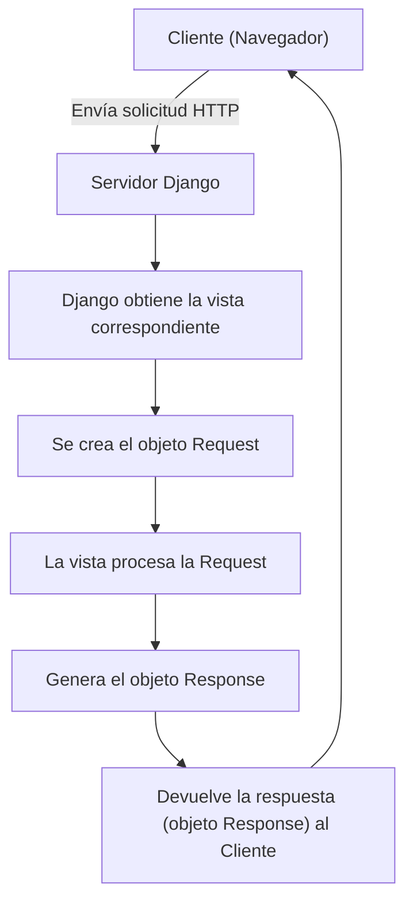
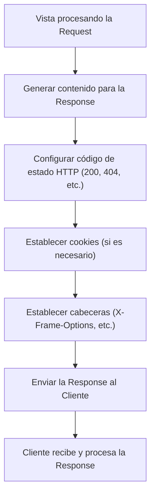

Cuando trabajamos con Django, nos enfrentamos constantemente a dos objetos fundamentales: `request` y `response`. Estos son los componentes que permiten la interacción entre el navegador del usuario y el servidor web. En este post, vamos a desglosar qué son estos objetos, como funcionan, etc.

<!-- more -->


## **¿Qué es el objeto request en Django?**

El objeto `request` es una instancia de la clase `HttpRequest` y contiene toda la información sobre una **solicitud HTTP** que el cliente (el navegador del usuario) envía al servidor. Este objeto es accesible dentro de las **vistas** de Django y te proporciona todos los datos que necesitas sobre la petición, como los parámetros de la URL, las cabeceras HTTP, el método HTTP utilizado (GET, POST, etc.), y los datos enviados por el usuario.

<div style="text-align:center" class="mermaid-container">
<div class="mermaid-title">Ciclo Básico de una Request en Django</div>

</div>


### **Atributos comunes del objeto request**

- **`request.method`**

    Es el método HTTP utilizado en la solicitud. Puede ser `GET`, `POST`, `PUT`, `DELETE`, etc.  
    ```py title="Ejemplo"
    if request.method == "POST":
        # Realiza algo con los datos enviados a través de un formulario
    ```

- **`request.GET`**

    Un diccionario que contiene los parámetros de consulta de la URL (para solucitudes GET). Es útil cuando tienes formularios o enlaces con parámetros en la URL. 
    ```py title="Ejemplo"
    # Si la URL es /search/?q=django
    search_query = request.GET['q'] # 'django'
    ```

- **`request.POST`**

    Un diccionario que contiene los datos enviados en el cuerpo de la solicitud para las solicitudes `POST`. Este atributo se usa comúnmente para procesar datos de formularios. 
    ```py title="Ejemplo"
    # Si el formulario tiene un campo 'username'
    username = request.POST['username']
    ```

- **`request.path`**

    El path de la URL de la solicitud. Esto incluye la ruta después del dominio, por ejemplo, `/home/` o `/profile/123`.
    ```py title="Ejemplo"
    print(request.path)  # '/home/'
    ```

- **`request.FILES`**

    Un diccionario que contiene los archivos enviados a través de un formulario. Esto es útil para manejar cargas de archivos.
    ```py title="Ejemplo"
    uploaded_file = request.FILES['document']
    ```

- **`request.user`**

    Un atributo muy útil cuando estás trabajando con autenticación de usuarios. Contiene el usuario autenticado si se ha iniciado sesión, o `AnonymousUser` si no lo está.
    ```py title="Ejemplo"
    if request.user.is_authenticated:
        print("Usuario autenticado")
    ```


---

## **¿Qué es el objeto response en Django?**

Así como tenemos un objeto `request`, también tenemos un objeto `response` que es instancia de la clase `HttpResponse` y contiene la respuesta que Django envía de vuelta al cliente después de procesar la solicitud. Es lo que se utiliza generalmente como resultado de la vista y lo envía al navegador del usuario.

<div style="text-align:center" class="mermaid-container">
<div class="mermaid-title">Generación de una Response en Django</div>

</div>

### **Atributos y métodos comunes del objeto response**

- **`response.content`**

    El contenido de la respuesta, normalmente el HTML que será mostrado en el navegador. Este atributo puede ser utilizado para manipular el contenido antes de que envíe al cliente.  
    ```py title="Ejemplo"
    response = HttpResponse("Hello, world!")
    print(response.content)  # b'Hello, world!'
    ```

- **`response.status_code`**

    El código de estado HTTP de la respuesta. Por ejemplo, `200` para una respuesta exitosa, `404` para no encontrado, `500` para error interno, etc.  
    ```py title="Ejemplo"
    response.status_code = 404  # Código de error para página no encontrada
    ```

- **`redirect`**

    Este método se utiliza para redirigir al usuario a otra URL. Se usa frecuentemente para redirigir después de una operación exitosa, como al enviar un formulario o iniciar sesión.  
    ```py title="Ejemplo"
    from django.shorcuts import redirect
    return redirect('success_page')
    ```

- **`response['Header-Name']`**

    Puedes establecer cabeceras HTTP personalizadas en la respuesta. Por ejemplo, agregar un tipo de contenido específico o configurar cabeceras de seguridad.  
    ```py title="Ejemplo"
    response['X-Frame-Options'] = 'DENY'
    ```
