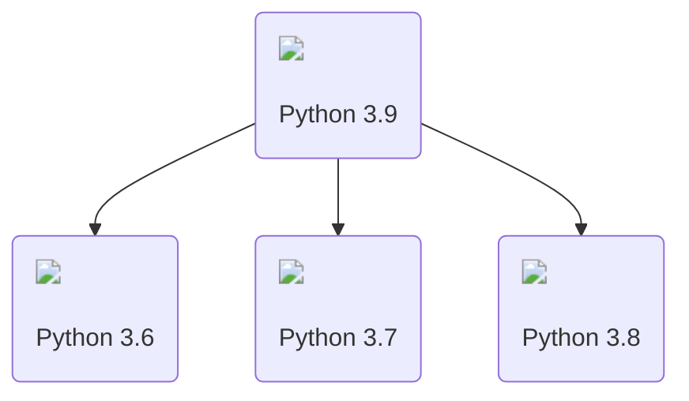

# Crea tu primera aplicación con Django

Aquí vamos realizar una aplicación que está basada en un artículo de la documentación de Django; [Escribiendo su primera aplicación en Django](https://docs.djangoproject.com/en/5.0/intro/){:target='_blank'}, la diferencia es que aquí se incluyen otros temas relacionados como la configuración de un entorno de desarrollo y conceptos que serán de mucha ayuda para el entendimiento a lo largo del tutorial.


## Puesta en marcha de un entorno de desarrollo

Cuando instalamos [Python3](https://www.python.org/){:target='blank'} obtenemos un único entorno global que es compartido por todos los proyectos y todo el código de Python. Si bien podríamos instalar **Django** y otros paquetes en el entorno global. Sin embargo sólo puedes instalar una versión en particular de cada paquete.

???+ note "Nota"

    Las aplicaciones Python instaladas en el entorno global pueden entrar en conflicto potencialmente unas con otras (Ej. si dependen de diferentes versiones del mismo paquete).

Si instalamos Django dentro del entorno por defecto/global sólo podrás apuntar a una sóla versión de Django en la computadora. Esto puede ser un problema si quieres crear en el futuro nuevos sitios (usando las útilmas versiones de Django) pero manteniendo los sitios web que dependen de versiones más antiguas.

Como resultado, los desarrolladores experimentados en Python/Django normalmente configuran y ejecutan las aplicaciones Python dentro de [entornos virtuales Python](https://docs.python.org/es/3/tutorial/venv.html){:target='blank'} independientes.


<script src="https://kit.fontawesome.com/6b8f0c7049.js" crossorigin="anonymous"></script>


<div style="text-align:center">

</div>

## Crear un nuevo proyecto

Una vez tenemos a nuestra disposición Django, se nos habilitará un script para la gestión de proyectos.

Desde la línea de comando, nos vamos al directorio donde vamos a trabajar y usamos el script `django-admin` de la siguiente manera para crear un nuevo proyecto:

```shell
django-admin startproject misitio
```

## Ejecutar el servidor de desarrollo

Para verificar que nuestro proyecto funcione. Cambiamos al directorio del proyecto generado, y dentro ejecutamos el siguiente comando:

```shell
python manage.py runserver
```

???+ note "Nota"

    De forma predeterminada, cuando lanzamos el servidor de desarrollo se utiliza el puerto 8000.

    Si deseamos cambiar el puerto del servidor, lo pasamos como argumento al comando `runserver`:

    ```shell
    python manage.py runserver 8080
    ```

???+ abstract "Recarga automática"

    El servidor de desarrollo recarga automáticamente el código Python para cada solicitud según sea necesario. Sin embargo, algunas cosas como agregar nuevos archivos no activan el reinicio, por lo que tendríamos que reiniciar el servidor.

---

## Crear una aplicación

Cada aplicación que se crea en Django consta de un paquete Python que sigue una determinada convención. Django incluye una utilidad que crea automáticamente la estructura básica de una aplicación.

???+ abstract "Diferencia entre Proyecto y Aplicación"
    Una aplicación es una aplicación web que sirve para algo (Ej: Blog, aplicación de encuestas, etc.).

    Un proyecto es una colección de aplicaciones para un sitio web en particular.

Para crear una aplicación, desde la línea de comandos ejecutamos lo siguiente (asegúrate de estar en el mismo directorio que el script `manage.py`):

```
python manage.py startapp encuestas
```

---

## Definir una primera vista

Abrimos el archivo **encuestas/views.py**

=== ":octicons-file-code-16: `encuestas/views.py`"

    ```{ .python  }
    from django.http import HttpResponse


    def index(request):
        return HttpResponse("Hola mundo.")
    ```

    
Estamos remplazando el contenido del archivo para ver el tipo de vista más simple en Django. Para poder llamar a la vista y mostrarla, se requiere asignarla a una URL.


Para ello creamos un nuevo archivo dentro del directorio **encuestas** llamado `urls.py`:

=== "Linux - Bash"

    ```shell
    touch encuestas/urls.py
    ```
=== "Windows - CMD"

    ```bat
    type nul > encuestas/urls.py
    ```
Luego abrimos ese archivo creado para incluir el siguiente código:

=== ":octicons-file-code-16: `encuestas/urls.py`"

    ```{ .python  }
    from django.urls import path

    from . import views

    urlpatterns = [
        path("", views.index, name="index"),
    ]
    ```

Cumplido lo anterior, el siguiente paso es configurar el **URLconf** raíz para añadir el módulo `encuestas.urls`.

Ahora en el archivo `misitio_django/urls.py` lo añadimos de la siguiente forma:

=== ":octicons-file-code-16: `misitio/urls.py`"

    ```py hl_lines="5"
    from django.contrib import admin
    from django.urls import include, path

    urlpatterns = [
        path("encuestas/", include("encuestas.urls")),
        path("admin/", admin.site.urls),
    ]
    ```

Como vemos importamos desde `django.urls` la función `include()` que nos permite hacer referencias a otras **URLconf**.

La idea de esta función `include()` es facilitar la conexión y unificar la reproducción de URL. Dado que todo de lo que tenga que ver con la **aplicación de encuestas** estarán configuradas en su propia URLconf (`encuestas/urls.py`) y si en el caso que coloquemos nuestro archivo con las URLconf en otra raíz o subdirectorio la aplicación seguirá trabajando.

Ahora tenemos la vista **index** vinculada a los URLconf. Podemos comprobar su funcionamiento ejecutando el servidor, si lo a cerrado vuelva a correr el comando:

```shell
python manage.py runserver
```

Luego vistamos en nuestro navegador visitamos [http://localhost:8000/encuestas/](http://localhost:8000/encuestas/){: target='_blank' }

También vemos que tenemos la función `path()` que recibe cuatro argumentos, dos de ello son requeridos **route** y **view**, y dos son opcionales **kwargs** y **name**.

### path(): route

**route** es una cadena que contiene un patrón de URL. Cuando Django procesa una petición comienza por el primer patrón en **urlpatters** y continua hacia abajo por la lista comparando la **URL** solicitada con cada patrón hasta que encuentra el que corresponda.

Tener en cuenta que estas expresiones regulares no buscan parámetros **GET** y **POST** o el nombre de dominio. Por ejemplo si la petición es a la dirección **http://www.midominio.com/encuestas/**, la URLconf buscará **encuestas/**. En una petición a la dirección **http://www.midominio.com/encuestas/?page=2** la URLconf también buscará **encuestas/**.

### path(): view

Cuando Django encuentra una coincidencia de expresiones regulares llama a la función de la vista especificada con un objeto **HttpRequest** como primer argumento y cualquiera de los **valores capturados** de la ruta como argumentos de palabra clave.

### path(): kwargs

Los argumentos arbitrarios de palabra clave se pueden pasar en un diccionario a la vista de destino.

### path(): name

Dar un nombre a su URL le permite referirse a ella de forma inequívoca desde otras partes de Django sobre todo desde las plantillas. Esta potente característica le permite realizar cambios globales en los patrones de URL de nuestro proyecto modificando solo un único archivo.

---

## Creando modelos

A continuación definiremos modelos, sobre todo para entender la estructura de base de datos.

En nuestra aplicación de encuesta, crearemos dos modelos **Pregunta** y **Eleccion**. Una **Pregunta** tendrá un campo que es la fecha de publicación. Una **Eleccion** tiene dos campos, el texto de la elección y un recuento de voto. Cada **Eleccion** está asociado con una **Pregunta**.

Estos conceptos están representados por clases de Python. Vamos al archivo `encuestas/models.py` y agregamos lo siguiente:

=== ":octicons-file-code-16: `encuestas/models.py`"
    ```python
    from django.db import models


    class Pregunta(models.Model):
        texto_pregunta = models.CharField(max_length=200)
        fecha_publicacion = models.DateTimeField("fecha de publicación")


    class Eleccion(models.Model):
        pregunta = models.ForeignKey(Pregunta, on_delete=models.CASCADE)
        texto_eleccion = models.CharField(max_length=200)
        votos = models.IntegerField(default=0)
    ```

Aquí, cada modelo está representado por una clase que divide en subclases a partir de `django.db.models.Model`. Cada modelo tiene una serie de variables de clase, cada una de las cuales representa un campo de la base de datos en el modelo.

Cada campo está representado por una instancia de una clase **Field**, por ejemplo, **CharField** para campos de caracteres y **DateTimeField** para variables de tiempo y fecha. Esto le dice a Django qué tipo de datos cada campo contiene.

El nombre de cada instancia **Field** (por ejemplo, **texto_pregunta** o **fecha_publicacion**) es el nombre del campo. Django va usar este valor en el código para usarlo como nombre de la columna en la base de datos.