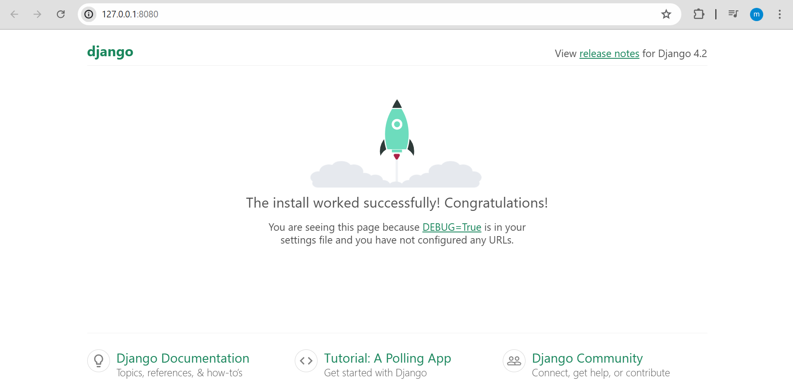

# Comenzar con Django

Django es un framework web del lado del servidor extremadamente popular, es de código abierto y escrito en [Python](//python.org){:target='blank'} y respeta el patrón de diseño conocido como **modelo-vista-controlador** (MVC)


## Instalación de Software para crear entorno virtual

Después de instalar Python y pip, procedemos a instalar [virtualenvwrapper](https://virtualenvwrapper.readthedocs.io/en/latest/) (que incluye virtualenv) usando pip3:

```bash title="bash"
sudo pip3 install virtualenvwrapper
```

A continuación se añade las siguientes líneas en el archivo de inicio del shell (éste es un archivo oculto `.bashrc` o `.zshrc` si usas [zsh](https://en.wikipedia.org/wiki/Z_shell))

=== ":octicons-file-code-16: `.bashrc`"
	```bash
	export WORKON_HOME=$HOME/.virtualenvs # (1)
	export VIRTUALENVWRAPPER_PYTHON=/usr/bin/python3
	export PROJECT_HOME=$HOME/Devel
	source /usr/local/bin/virtualenvwrapper.sh #(2)
	```

	1.  La variable `WORKON_HOME` determina en qué directorio se deben crear los entornos virtuales de Python.
	
	2. Por último, se debe agregar esta línea al archivo `~/.bashrc` para especificar en dónde está ubicado el ejecutable de virtualenvwrapper.

### Cómo crear entornos virtuales

Se debe ejecutar el comando `mkvirtualenv` más el nombre del entorno virtual Python que queremos crear:

```bash title="bash"
mkvirtualenv nombre_entorno
```

### Cómo activar un entorno virtual

Para activar un virtualenv con Virtualenvwrapper solamente se necesita ejecutar el comando `workon` más el nombre del virtualenv en la terminal:

=== "Crear el entorno"
	```bash title="bash"
	workon django-test
	```
=== "Salida"
	```bash
	created virtual environment CPython3.9.2.final.0-64 in 9185ms
	  creator CPython3Posix(dest=/home/enidev911/.virtualenvs/django-test, clear=False, no_vcs_ignore=False, global=False)
	  seeder FromAppData(download=False, pip=bundle, setuptools=bundle, wheel=bundle, via=copy, app_data_dir=/home/enidev911/.local/share/virtualenv)
	    added seed packages: pip==24.1, setuptools==70.1.0, wheel==0.43.0
	  activators BashActivator,CShellActivator,FishActivator,NushellActivator,PowerShellActivator,PythonActivator
	virtualenvwrapper.user_scripts creating /home/enidev911/.virtualenvs/django-test/bin/predeactivate
	virtualenvwrapper.user_scripts creating /home/enidev911/.virtualenvs/django-test/bin/postdeactivate
	virtualenvwrapper.user_scripts creating /home/enidev911/.virtualenvs/django-test/bin/preactivate
	virtualenvwrapper.user_scripts creating /home/enidev911/.virtualenvs/django-test/bin/postactivate
	virtualenvwrapper.user_scripts creating /home/enidev911/.virtualenvs/django-test/bin/get_env_detail
	```

### Cómo eliminar entornos virtuales

Al ejecutar el comando `rmvirtualenv` más el nombre del virtualenv, virtualenvwrapper se encarga de borrar el virtualenv con todas los paquetes que hayamos instalado en él:

```bash title="bash"
rmvirtualenv nombre_entorno
```


## Instalar Django 🚀

#### Con pip (recomendado)

=== "Instalar última versión disponible"

	```plaintext title="bash"
	pip3 install django
	```

=== "Instalar versión específica"

	```plaintext title="bash"
	pip3 install django==3.2
	```

Podemos comprobar que está instalado Django ejecutando el siguiente comando (el comando comprueba que Python puede encontrar el módulo Django):

```bash title="bash"
python3 -m django --version
# 3.2.4
```

### Generar un nuevo proyecto

Para crear un nuevo esqueleto de un sitio llamado "misitio" usando la herramienta [`django-admin`](https://docs.djangoproject.com/en/5.0/ref/django-admin/) como se muestra a continuación:

```bash title="bash"
django-admin startproject misitio
cd misitio
```

### Ejecutar el servidor de desarrollo

Para verificar que nuestro proyecto funcione. Cambiamos al directorio del proyecto generado, y dentro ejecutamos el siguiente comando:

=== "Ejecutar el servidor"
	```bash title="bash"
	python manage.py runserver
	```
=== "Salida"
	```plaintext
	Watching for file changes with StatReloader
	Performing system checks...
	
	System check identified no issues (0 silenced).
	
	You have 18 unapplied migration(s). Your project may not work properly until you apply the migrations for app(s): admin, auth, contenttypes, sessions.
	Run 'python manage.py migrate' to apply them.
	July 17, 2024 - 03:53:10
	Django version 4.2.14, using settings 'mysite.settings'
	Starting development server at http://127.0.0.1:8000/
	Quit the server with CONTROL-C.
	```

???+ note "Nota"

    De forma predeterminada, cuando lanzamos el servidor de desarrollo se utiliza el puerto 8000.

    Si deseamos cambiar el puerto del servidor, lo pasamos como argumento al comando `runserver`:

    ```shell
    python manage.py runserver 8080
    ```

???+ info "Recarga automática"

    El servidor de desarrollo recarga automáticamente el código Python para cada solicitud según sea necesario. Sin embargo, algunas cosas como agregar nuevos archivos no activan el reinicio, por lo que tendríamos que reiniciar el servidor.

{ align="right" width="300"}
Si visitamos <http://127.0.0.1:8000/> veremos la página por defecto de nuestro sitio con django.