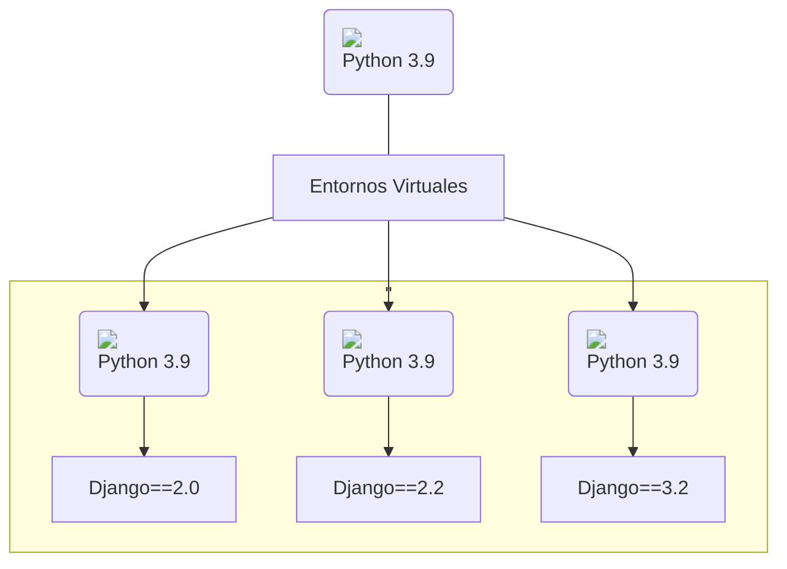

# Configurar entorno virtual

Cuando instalamos [Python3](https://www.python.org/){:target='blank'} obtenemos un único entorno global que es compartido por todos los proyectos y todo el código de Python. Si bien podríamos instalar **Django** y otros paquetes en el entorno global. Sin embargo sólo puedes instalar una versión en particular de cada paquete.

!!! warning "Cuidado"

    Las aplicaciones Python instaladas en el entorno global pueden entrar en conflicto potencialmente unas con otras (Ej. si dependen de diferentes versiones del mismo paquete).

Si instalamos Django dentro del entorno por defecto/global sólo podrás apuntar a una sóla versión de Django en la computadora. Esto puede ser un problema si quieres crear en el futuro nuevos sitios (usando las útilmas versiones de Django) pero manteniendo los sitios web que dependen de versiones más antiguas.

Como resultado, los desarrolladores experimentados normalmente configuran y ejecutan las aplicaciones Python dentro de [entornos virtuales Python](https://docs.python.org/es/3/tutorial/venv.html){:target='blank'} independientes.


<script src="https://kit.fontawesome.com/6b8f0c7049.js" crossorigin="anonymous"></script>


<div style="text-align:center" class="mermaid-container">
<div class="mermaid-title">Esquema de Entornos Virtuales de Python</div>

</div>

## Instalación de Software para crear entorno virtual

Después de instalar Python y pip, procedemos a instalar [virtualenvwrapper](https://virtualenvwrapper.readthedocs.io/en/latest/) (que incluye virtualenv) usando pip3:

```bash title="bash"
sudo pip3 install virtualenvwrapper
```

A continuación se añade las siguientes líneas en el archivo de inicio del shell (éste es un archivo oculto `.bashrc` o `.zshrc` si usas [zsh](https://en.wikipedia.org/wiki/Z_shell))

=== ":octicons-file-code-16: `.bashrc`"
	```bash
	export WORKON_HOME=$HOME/.virtualenvs # (1)
	export VIRTUALENVWRAPPER_PYTHON=/usr/bin/python3
	export PROJECT_HOME=$HOME/Devel
	source /usr/local/bin/virtualenvwrapper.sh #(2)
	```

	1.  La variable `WORKON_HOME` determina en qué directorio se deben crear los entornos virtuales de Python.
	
	2. Por último, se debe agregar esta línea al archivo `~/.bashrc` para especificar en dónde está ubicado el ejecutable de virtualenvwrapper.

### Cómo crear entornos virtuales

Se debe ejecutar el comando `mkvirtualenv` más el nombre del entorno virtual Python que queremos crear:

```bash title="bash"
mkvirtualenv nombre_entorno
```

### Cómo activar un entorno virtual

Para activar un virtualenv con Virtualenvwrapper solamente se necesita ejecutar el comando `workon` más el nombre del virtualenv en la terminal:

=== "Crear el entorno"
	```bash title="bash"
	workon django-test
	```
=== "Salida"
	```bash
	created virtual environment CPython3.9.2.final.0-64 in 9185ms
	  creator CPython3Posix(dest=/home/enidev911/.virtualenvs/django-test, clear=False, no_vcs_ignore=False, global=False)
	  seeder FromAppData(download=False, pip=bundle, setuptools=bundle, wheel=bundle, via=copy, app_data_dir=/home/enidev911/.local/share/virtualenv)
	    added seed packages: pip==24.1, setuptools==70.1.0, wheel==0.43.0
	  activators BashActivator,CShellActivator,FishActivator,NushellActivator,PowerShellActivator,PythonActivator
	virtualenvwrapper.user_scripts creating /home/enidev911/.virtualenvs/django-test/bin/predeactivate
	virtualenvwrapper.user_scripts creating /home/enidev911/.virtualenvs/django-test/bin/postdeactivate
	virtualenvwrapper.user_scripts creating /home/enidev911/.virtualenvs/django-test/bin/preactivate
	virtualenvwrapper.user_scripts creating /home/enidev911/.virtualenvs/django-test/bin/postactivate
	virtualenvwrapper.user_scripts creating /home/enidev911/.virtualenvs/django-test/bin/get_env_detail
	```

### Cómo eliminar entornos virtuales

Al ejecutar el comando `rmvirtualenv` más el nombre del virtualenv, virtualenvwrapper se encarga de borrar el virtualenv con todas los paquetes que hayamos instalado en él:

```bash title="bash"
rmvirtualenv nombre_entorno
```