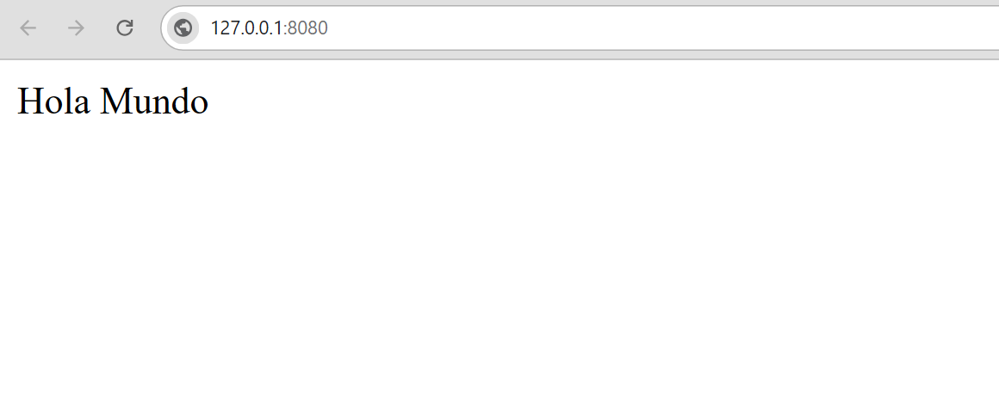

Una vista es una función o un método que básicamente hace dos cosas, toma como **argumento un objeto HttpRequest**, en el que va la información referente a la solicitud que estamos haciendo, como por ejemplo si el método empleado es `POST` o `GET`.

Para ver como gestiona Django las **vistas**, las relaciona con el **modelo de datos** y envía esa información al **navegador** vamos a empezar creando una vista sencilla, simplemente vamos a mostrar un mensaje por pantalla:


=== ":octicons-file-code-16: `myapp/views.py`"
	```py title="views.py"
	from django.http import HttpRequest, HttpResponse
	
	def first_view(request: HttpRequest) -> HttpResponse:
		return HttpResponse("Hello World!")
	```
=== "Explorador"
	```plaintext hl_lines="12"
	 .
	├──  db.sqlite3
	├──  manage.py
	├──  myapp
	│   ├──  __init__.py
	│   ├──  admin.py
	│   ├──  apps.py
	│   ├──  migrations
	│   │   └──  __init__.py
	│   ├──  models.py
	│   ├──  tests.py
	│   └──  views.py
	└──  mysite
	```

Ahora tenemos que asociar la vista que acabamos de definir con una **dirección**, para hacerlo vamos a manejar dos archivos, uno lo crea Django al iniciar el proyecto y está en `mysite/urls.py`, el otro lo tendremos que crear nosotros dentro del directorio de nuestra aplicación `myapp/urls.py`

=== ":octicons-file-code-16: `mysite/urls.py`"
	```python hl_lines="2 6"
	from django.contrib import admin
	from django.urls import path, include

	urlpatterns = [
		path('admin/', admin.site.urls),
		path('', include('myapp.urls'))
	]
	```
=== ":octicons-file-code-16: `myapp/urls.py`"
	```python hl_lines="2 5"
	from django.urls import path
	from . import views

	urlpatterns = [
		path('', views.first_view, name='first-view'),
	]
	```
=== "Explorador"
	```bash hl_lines="12"
	 .
	├──  db.sqlite3
	├──  manage.py
	├──  myapp
	│   ├──  __init__.py
	│   ├──  admin.py
	│   ├──  apps.py
	│   ├──  migrations
	│   │   └──  __init__.py
	│   ├──  models.py
	│   ├──  tests.py
	│   ├──  urls.py # (1)
	│   └──  views.py
	└──  mysite
	```

	1. Este archivo lo creamos manualmente 

{style="border: 1px solid #ccc"}

!!! info
	A diferencia de los objetos `HttpRequest` que Django crea automáticamente, los objetos `HttpResponse` son nuestra responsabilidad.

Sigamos y definamos otra vista que brinde información sobre la petición realizada:

=== ":octicons-file-code-16: `myapp/views.py`"
	```py title="views.py"
	def info_request(request: HttpRequest) -> HttpResponse:
		response = f"""
		Método de la solicitud: {request.method}<br />
		Esquema de la solicitud: {request.scheme}<br />
		Codificación de la solicitud: {request.encoding}<br />
		MIME de la solicitud: {request.content_type}<br />
		Tipo de navegador: {request.headers["User-Agent"]}
		"""
		return HttpResponse(response) 
	```

=== "Explorador"
	```plaintext hl_lines="12"
	 .
	├──  db.sqlite3
	├──  manage.py
	├──  myapp
	│   ├──  __init__.py
	│   ├──  admin.py
	│   ├──  apps.py
	│   ├──  migrations
	│   │   └──  __init__.py
	│   ├──  models.py
	│   ├──  tests.py
	│   └──  views.py
	└──  mysite
	```

Ahora tenemos que incluir esta vista en el **urlpatterns**:

=== ":octicons-file-code-16: `myapp/urls.py`"
	```python title="urls.py" hl_lines="6"
	from django.urls import path
	from . import views
	
	urlpatterns = [
		path('', views.first_view, name='first-view'),
		path('info/', views.info_request, name='info-request')
	]
	```
=== "Explorador"
	```plaintext hl_lines="12"
	 .
	├──  db.sqlite3
	├──  manage.py
	├──  myapp
	│   ├──  __init__.py
	│   ├──  admin.py
	│   ├──  apps.py
	│   ├──  migrations
	│   │   └──  __init__.py
	│   ├──  models.py
	│   ├──  tests.py
	│   ├──  urls.py
	│   └──  views.py
	└──  mysite
	```

---

## Cargar una plantilla (template)

La función `render()` toma el objeto de la solicitud (*request*) como primer argumento, un nombre de plantilla como segundo argumento y un diccionario como tercer argumento opcional.


### Definir una función que retorna un template

```py title="views.py" hl_lines="1 4"
from django.shortcuts import render

def first_template(request: HttpRequest) -> HttpResponse:
	return render(request, 'index.html')
```

=== "Crear directorios y archivo"
	```bash title="bash"
	mkdir -p myapp/templates
	touch myapp/templates/index.html
	```
=== "Explorador"
	```plaintext hl_lines="3 4"
	 .
	├──  myapp
    │	└──   templates
    │        └──  index.html
	└──  mysite
	```

Escribimos algo en la plantilla:

=== ":octicons-file-code-16: `myapp/templates/index.html`"
	```html
	<h1>Hello World!</h1>
	<h2>From template 'index.html'!</h2>
	```
=== "Explorador"
	```bash hl_lines="12"
	 .
	├──  db.sqlite3
	├──  manage.py
	├──  myapp
	│   ├──  __init__.py
	│   ├──  admin.py
	│   ├──  apps.py
	│   ├──  migrations
	│   │   └──  __init__.py
	│   ├──  models.py
	│   ├──  templates
	│   │   └──  index.html
	│   ├──  tests.py
	│   ├──  urls.py
	│   └──  views.py
	└──  mysite
	```