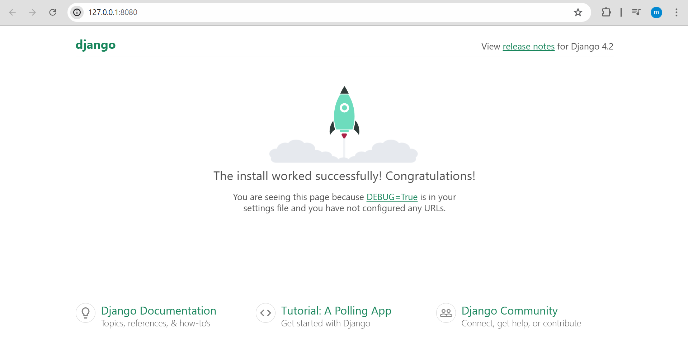

# Instalar Django

### Con pip (recomendado)

=== "Instalar última versión disponible"

	```plaintext title="bash"
	pip3 install django
	```

=== "Instalar versión específica"

	```plaintext title="bash"
	pip3 install django==3.2
	```

Podemos comprobar que está instalado Django ejecutando el siguiente comando (el comando comprueba que Python puede encontrar el módulo Django):

```bash title="bash"
python3 -m django --version
# 3.2.4
```

### Generar un nuevo proyecto

Para crear un nuevo esqueleto de un sitio llamado "mysite" usando la herramienta [`django-admin`](https://docs.djangoproject.com/en/5.0/ref/django-admin/) como se muestra a continuación:

```bash title="bash"
django-admin startproject mysite
cd mysite
```

### Ejecutar el servidor de desarrollo

Para verificar que nuestro proyecto funcione. Cambiamos al directorio del proyecto generado, y dentro ejecutamos el siguiente comando:

=== "Ejecutar el servidor"
	```bash title="bash"
	python manage.py runserver
	```
=== "Salida"
	```plaintext
	Watching for file changes with StatReloader
	Performing system checks...
	
	System check identified no issues (0 silenced).
	
	You have 18 unapplied migration(s). Your project may not work properly until you apply the migrations for app(s): admin, auth, contenttypes, sessions.
	Run 'python manage.py migrate' to apply them.
	July 17, 2024 - 03:53:10
	Django version 4.2.14, using settings 'mysite.settings'
	Starting development server at http://127.0.0.1:8000/
	Quit the server with CONTROL-C.
	```

???+ note "Nota"

    De forma predeterminada, cuando lanzamos el servidor de desarrollo se utiliza el puerto 8000.

    Si deseamos cambiar el puerto del servidor, lo pasamos como argumento al comando `runserver`:

    ```shell
    python manage.py runserver 8080
    ```

???+ info "Recarga automática"

    El servidor de desarrollo recarga automáticamente el código Python para cada solicitud según sea necesario. Sin embargo, algunas cosas como agregar nuevos archivos no activan el reinicio, por lo que tendríamos que reiniciar el servidor.

Si visitamos <http://127.0.0.1:8080/> veremos la página por defecto de nuestro sitio con django.

{style="border: 1px solid #ccc"}